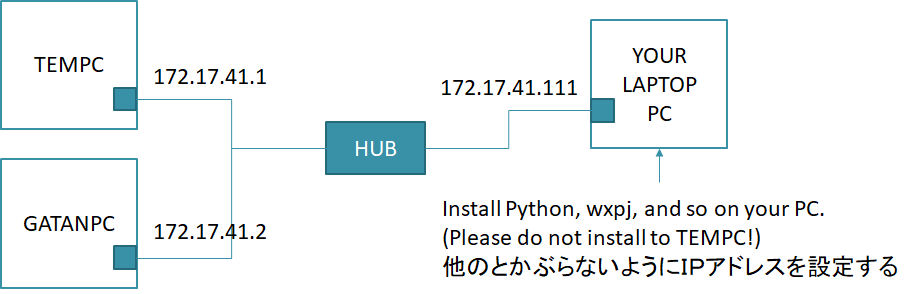

# wxpj

A package for Image analysis and TEM control


## Getting Started

These instructions will get you a copy of the project up and running on your local machine for development and testing purposes. See deployment for notes on how to deploy the project on a live system.

<!--
私の環境では 2022/9/9 現在，以下のバージョンで動作しています．
```
<Python 3.8.6 (tags/v3.8.6:db45529, Sep 23 2020, 15:52:53) [MSC v.1927 64 bit (AMD64)]>
  wx version 4.1.1
  scipy/numpy version 1.7.3/1.20.1
  matplotlib version 3.4.0/WXAgg
  Image version 8.1.0
  cv2 version 4.5.1
  mwx 0.71.3
  pJ 0.50
```
-->
私の環境では 2023/2/28 現在，以下のバージョンで動作しています．
```Python 3.10.8
  <Python 3.10.8 (tags/v3.10.8:aaaf517, Oct 11 2022, 16:50:30) [MSC v.1933 64 bit (AMD64)]>
  wx version 4.2.1a1.dev5545+a3b6cfec msw (phoenix) wxWidgets 3.2.1
  scipy/numpy version 1.10.0/1.24.2
  matplotlib version 3.6.3/WXAgg
  Image version 9.4.0
  cv2 version 4.7.0
  mwx 0.79.5
```





### Prerequisites

:memo: wxpj 0.46 `GOOD BYE PYJEM` becoms PyJEM-independent.

***Don't use Anaconda because wxPython cannot be installed.***

* ~~[Python 3.8.6 for Windows](https://www.python.org/downloads/release/python-386/)  
    if you use PyJEM, this version is recommended.~~

* [Python 3.10.8 for Windows](https://www.python.org/downloads/release/python-3108/)  
    This version is for `GOOD BYE PYJEM`.

* [Git for Windows](https://git-scm.com/)  
    required to pip-install the latest modules from GitHub.


### Installing

Create a workspace or venv to install.

1. Install Python packages (from pypi) using batch files  

    To install PY38+ packages:
    ```
    py -m pip install -U pip
    py -m pip install scipy opencv-python pillow matplotlib wxpython
    py -m pip install pywin32 flake8 httplib2
    py -m pip install -U mwxlib
    git clone https://github.com/komoto48g/wxpj.git
    ```


#### Note (for internal use only)

- 社内からインストールする場合プロキシが見つからない為に失敗するかもしれません．
  その場合はまず次の設定を行ってください
```
set HTTPS_PROXY=http://i-net.jeol.co.jp:80
set HTTP_PROXY=http://i-net.jeol.co.jp:80
```


### Updating

To update your packages, follow the steps above again.
Remove the wxpj directory before updating. Otherwise the latest wxpj will not be cloned.


## How to execute wxpyJemacs

Launch `wxpj/wxpyJemacs.py`.


## How to terminate wxpyJemacs

Press [x] Button.

When you close the program, a popup window will appear asking "Do you want to save session before closing program?".
The session is like a project file, and it roughly saves plugins, parameters, windows layouts, buffers, etc.
Click [OK]. Then, the next time you start the program with the session file, you can start it in the same state as when it was last closed.


## How to restart the session

Suppose the session file is "user.jssn".
Start from the command prompt in your workdir:
```
py /(your-workdir)/wxpj/wxpyjemacs.py -suser
```
<!--
The meanings of the command arguments are:

    -sxxx: Start xxx session
-->
If `.jssn` is associated with the batch file (pJ.cmd), you can double-click the session file to restart the program easily. The pJ.cmd file would be like this:
```
py /(your-workdir)/wxpj/wxpyJemacs.py -s%*
```

## Deployment

Additional notes about how to deploy this on a live system

    !! PYJEM.TEM3 機能を使用するためには PY <= 3.5 (以下) をインストールしてください．
    !! 別途，TemExternal のインストールが必要です．

<!--
:memo: バージョン 0.46 以降では不要になります．↑
       No longer required after version 0.46.
-->


## Built With

* [pyDM3reader] - Python DM3 Reader (http://microscopies.med.univ-tours.fr/)

    * Pierre-Ivan Raynal - *Initial work* -  
        http://microscopies.med.univ-tours.fr/  
        https://bitbucket.org/piraynal/pydm3reader/src/master/  
    * Philippe Mallet-Ladeira
    * Greg Jefferis - *Transposition and adaptation of the DM3_Reader ImageJ plug-in* -  
        https://imagejdocu.tudor.lu/plugin/utilities/python_dm3_reader/start

* [pyGatan] - Leginon の Gatan 用スクリプトを PY3 で動くように修正したもの (Contributed by h.iijima)
    * Leginon (https://emg.nysbc.org/redmine/projects/leginon/wiki/Leginon_Homepage)  
    * https://bio3d.colorado.edu/SerialEM/  
    * https://bio3d.colorado.edu/SerialEM/download.html  


## Contributing

Please read [CONTRIBUTING](./CONTRIBUTING) for details on our code of conduct, and the process for submitting pull requests to us.

See also readme files included in each package for detail.


## Authors

* Kazuya O'moto - *Initial work* -

See also the list of who participated in this project.


## License

This project is licensed under the MIT License - see the [LICENSE](./LICENSE) file for details
