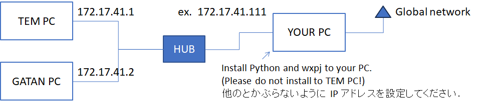

# wxpj

A package for Image analysis and TEM control


## Getting Started

These instructions will get you a copy of the project up and running on your local machine for development and testing purposes. See deployment for notes on how to deploy the project on a live system.


### Prerequisites




### Note (for internal use only)

社内でインストールする場合プロキシが見つからない為に失敗するかもしれません．
その場合はまず次の設定を行ってください

    $ set HTTPS_PROXY=http://i-net.jeol.co.jp:80


## Installing

1. Install Python.
    - Supports Python 3.10, 3.11, and 3.12.
    - Supports Python 3.13, but a few minor bugs are still unresolved.
    - ***Please do not use Anaconda, as wxPython cannot be installed.***

2. Install Python packages:
    ```
    $ pip install -U pywin32 httplib2 mwxlib
    ```

3. Install wxpj software.
    To download and install the wxpj project, follow these steps:
    1. Access the wxpj GitHub repository.
    2. Download as ZIP.
    3. Extract the ZIP file:
        - After downloading, locate the ZIP file on your computer.
        - Decide a destination folder and extract the contents.


### Tips: インストール作業を簡単に (社内向け)

これまで説明したインストール作業は，以下のコマンドで実行できます．
以下のテキストを "install-wxpj.bat" などの適当な名前で保存し，そのファイルを実行してください．

```
@setlocal

set HTTPS_PROXY=http://i-net.jeol.co.jp:80

pip install -U pywin32 httplib2 mwxlib
curl -L -o wxpj-master.zip https://github.com/komoto48g/wxpj/archive/refs/heads/master.zip
tar -xf wxpj-master.zip -C ./

@echo off

echo セッションファイル .jssn を関連付けるコマンドファイルを出力します．
echo python "%~dp0\wxpj-master\wxpyJemacs.py" -s"%%~nx1" > pJ.cmd

assoc .jssn=jssn_auto_file
ftype jssn_auto_file=%~dp0\pJ.cmd %%1

if %ERRORLEVEL% neq 0 (
    echo 拡張子の関連付けは管理者権限が必要です．
)
```

拡張子の関連付けも行いたい場合は，管理者権限が必要となります．


## How to run wxpyJemacs

Launch the main program:

    $ python ~/wxpyJemacs.py

Here, "~/" represents the directory where the main program is unzipped.


## How to terminate wxpyJemacs

Press [x] Button.

When you close the program, a popup window will appear asking "Do you want to save session before closing program?".
The session is like a project file, saving infomation such as plugins, parameters, windows layouts, buffers, and more.
Click [OK] to save. Then the next time you start the program with the session file, it will restore the program to the same state as when it was last closed.


## How to restart the session

To restart the session, launch the program with `-s` switch:

    $ python ~/wxpyJemacs.py -s<session file.jssn>

Then, the program will start in the same state as when the session was saved.


### Tips: To start the session more simply

以下のようなバッチファイルを，メインプログラムのディレクトリ (wxpj-master) のある場所に置き，`.jssn` を関連付けます．
これにより，`.jssn` をダブルクリックすることでプログラムが起動し，セッションを再開することができます．

pJ.cmd
```
python "%~dp0\wxpj-master\wxpyJemacs.py" -s%~nx1
```


## Deployment

Additional notes about how to deploy this on a live system

    !! PYJEM.TEM3 機能を使用するためには PY <= 3.5 (以下) をインストールしてください．
    !! 別途，TemExternal のインストールが必要です．


## Built With

* [pyDM3reader] - Python DM3 Reader (http://microscopies.med.univ-tours.fr/)

    * Pierre-Ivan Raynal - *Initial work* -  
        http://microscopies.med.univ-tours.fr/  
        https://bitbucket.org/piraynal/pydm3reader/src/master/  
    * Philippe Mallet-Ladeira
    * Greg Jefferis - *Transposition and adaptation of the DM3_Reader ImageJ plug-in* -  
        https://imagejdocu.tudor.lu/plugin/utilities/python_dm3_reader/start

* [pyGatan] - Leginon の Gatan 用スクリプトを PY3 で動くように修正したもの (Contributed by h.iijima)
    * Leginon (https://emg.nysbc.org/redmine/projects/leginon/wiki/Leginon_Homepage)  
    * https://bio3d.colorado.edu/SerialEM/  
    * https://bio3d.colorado.edu/SerialEM/download.html  


## Contributing

Please read [CONTRIBUTING](./CONTRIBUTING) for details on our code of conduct, and the process for submitting pull requests to us.

See also readme files included in each package for detail.


## Authors

* Kazuya O'moto - *Initial work* -

See also the list of who participated in this project.


## License

This project is licensed under the MIT License - see the [LICENSE](./LICENSE) file for details
